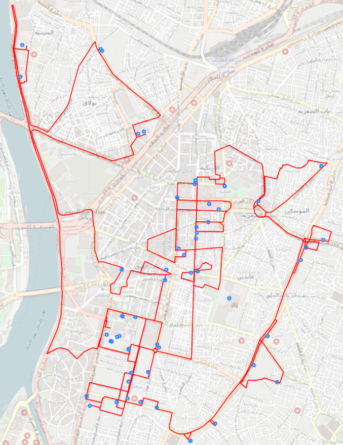
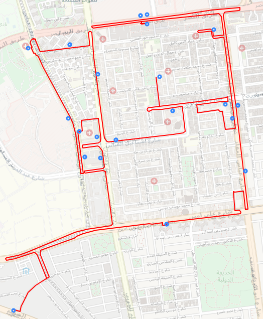

# Data Dictionary

---

You have to scrap the data from Banque Misr website

# Attribiutes

---

Governrator: Name of the government
Region: Name of the region
Lat: Latitude of each ATM
Long: Longitude of each ATM
Type of service: The services that each ATM can do (Withdrawal - deposit - currency exchange)

# Gaols

---

1. Cluster the ATMs to help the bank for finding the optimal route for filling the ATMs to save time.
2. Helping customers locate the nearest ATM easily depends on the type of service (Withdrawal - deposit - currency exchange).

# samples outputs

